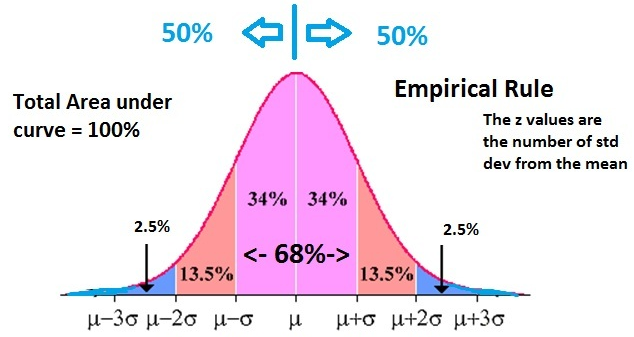

# The Normal or Gaussian Distribution

## Background and Motivations
Certainly you've heard of the normal distribution! It is certainly the most important and commonly used. Many variables tend to be normally distributed and in practice unknown quantities are often modelled as normal distributions. By the **central limit theorem** combining many random distributions also converges to the normal distribution. That is, as we continue to sample from independent random distributions, our results will more and more closely resemble the normal distribution as time goes on. There are certain mathematical assumptions that must be held in order for this to be true (an important one being an assumption of independence) but the results nonetheless often hold true and help explain why the normal distribution is so often observed in the real world.

## 68–95–99.7 rule
There is also the handy empiricial rule which gives you general cumulative percentages for the probability encompassed by data within 1, 2 and 3 standard deviations of the mean. For example, roughly 68% of the population should fall within the mean height, plus or minus 1 standard deviation. Similarly, 95% of the population should be within 2 standard deviations of the mean, and 99.7% within 3 standard deviations.



## Mathematical Definition

$f(x)=\frac{1}{\sqrt{2\pi}\sigma}e^{-\frac{1}{2}(\frac{x-\mu}{\sigma})^2}$

where $\mu$ is the mean and $\sigma^2$ is the variance.

You may also frequently here of **standard normal distribution** which has a **$\mu=0$** and **$\sigma^2=1$**.

## Z Scores
Z scores tell us how many standard deviations is from the mean. Using the empirical 68-95-99.7 rule above, a Z score of 3 would mean that an observation was indeed very rare on on the far right hand tail of a distribution. (Assuming the distribution is positive.)

<center>
[image source](http://www.statisticshowto.com/probability-and-statistics/hypothesis-testing/t-score-vs-z-score/)</center>

### Calculating a Z-score

Recall that the formula for calculating a Z-score for a given value is: 

<center></center>

Where:

$x = value$

$\mu = Population\ Mean$

$\sigma = Population\ Standard\ Deviation$ 

In the cell below, write a function that takes in an array of data and a value and returns the z-score for that value.  


```python
# Run this cell to import everything we'll need for this lab
import numpy as np
import scipy
import matplotlib.pyplot as plt
%matplotlib inline
import seaborn as sns
# Do not change the random seed, or you'll break things!
np.random.seed(0)
```


```python
def calculate_z_score_from_data(data, value):
    pass

test1 = np.random.normal(5, 3, 10)
print(calculate_z_score_from_data(test1, 5)) # -0.7631465574632231
print(calculate_z_score_from_data(test1, 1)) # -2.14186850501324
```
